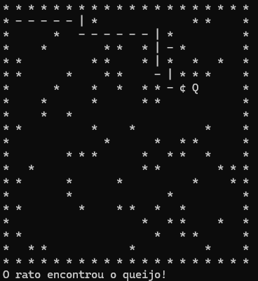

<h1 align="center">Labirinto</h1>
<h2 align="center">Algoritmo de Backtracking com Pilhas</h1>

### Tecnologias Utilizadas:
* C#

### Ferramentas Utilizadas:
* Microsoft Visual Studio

### Introdução:
O algoritmo de backtracking, em conjunto com pilhas, resolve problemas complexos explorando todas as soluções possíveis de forma organizada e eficiente. Imagine um labirinto, onde cada caminho tomado abre um leque de possibilidades.

### Passos do Algoritmo:

1. **Pilha Vazia:**
   - Comece com uma pilha vazia, pronta para ser preenchida com suas escolhas.

2. **Explore as Opções:**
   - Analise o problema e empilhe as opções possíveis na ordem em que são consideradas.

3. **Movimente-se pelo Caminho Escolhido:**
   - Com base na última escolha feita (o topo da pilha), avance no problema.

4. **Verifique se chegou ao destino:**
   - Se alcançar a solução desejada, parabéns! Caso contrário, continue para o próximo passo.

5. **Explore Alternativas ou Volte:**
   - **Novas Opções:** Adicione opções não exploradas à pilha e continue avançando.
   - **Caminho sem Saída:** Se não houver mais opções válidas, retroceda removendo a última escolha da pilha.

6. **Repita até Encontrar a Solução ou Exaurir as Opções:**
   - Continue repetindo os passos até encontrar a solução desejada ou até que todas as alternativas na pilha sejam esgotadas.

 ### Aplicação:

<figure>
  
</figure>
